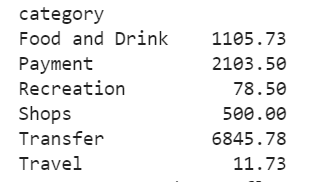
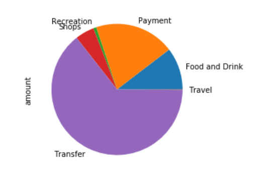
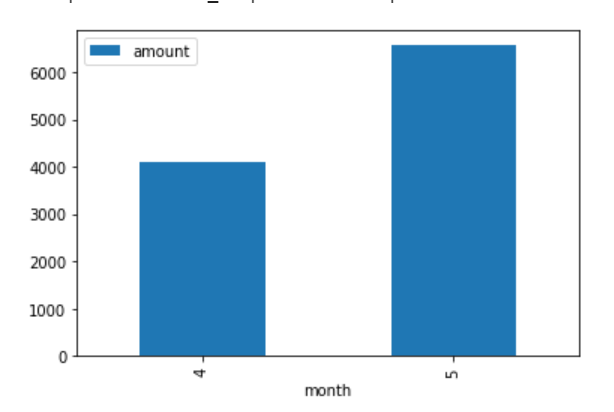
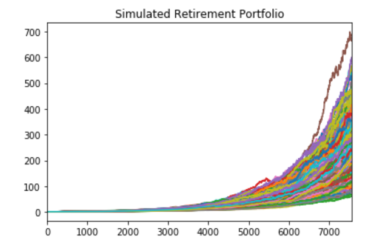
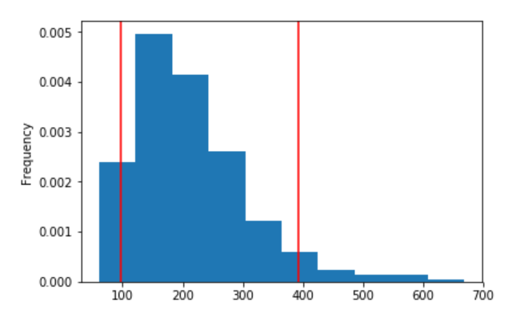

### Unit5_API_Homework
# Financial Report
## 1. Budget Analysis
* By connecting to the Developer Sandbox account using the Plaid Python SDK, I was able to fetch the customer transactions data for the last 90 days
### Total Expenses
* When analyzing customer spendings, I first calculated the expenses per category, as shown in the following table:

* In order to visualize the data, a pie chart is created:

* Based on the above analysis, we can see in the last 90 days, the customer spent the most on Transfer, which accounts for more than 50% of total spending; the customer spends the least amount of money on traveling. 

### Monthly Expenses
* When analyzing customer's monthly expenses, the following bar chart is created:

* The customer's spending has increased from April to May by more than $2,000

___

## 2. Retirement Planning
* By using the Alpaca API, I was able to fetch the closing prices for SPY and AGG; and constructed a 60/40 portfolio

* In order to traject portfolio performance, a Monte Carlo Simulation of 500 times and at least 30 years of cumulative returns is generated in the following:

* It shows that after 7,560 trading days (252*30), the retirement portfolio's cumulative return can range from as low as about 50%, to as high as 700%. 

* A 90% confidence interval is also created:

* It shows that the customer can be 95% certain that the true mean of the cumulative return lies in between 100% ~ 390%

* If the customer initially invested $20,000, the expected portfolio return in dollars at the 10th percentile is $2,298,268.74, which menas that there are only 10% of the other returns are lower than this. 

